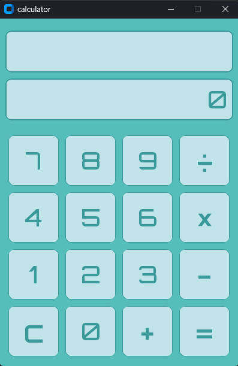

# CustomTkinter---Calculator
This is my first ever python project i have made

# CustomTkinter Calculator

This is my first ever Python project — a desktop calculator built with CustomTkinter, featuring a custom sci-fi themed font and a teal color palette.



## Features

- Clean, custom teal UI theme
- Two-line display (current expression + result)
- Standard operations: add, subtract, multiply, divide
- Backspace on single-click, full clear on long-press of the `c` button
- Expression evaluation powered by `sympy`
- Custom Orbitron font loaded at runtime via `tkextrafont`

## Tech Stack

- Python 3
- [CustomTkinter](https://github.com/TomSchimansky/CustomTkinter)
- [tkextrafont](https://pypi.org/project/tkextrafont/)
- [sympy](https://www.sympy.org/)

## Getting Started

### Prerequisites

```bash
pip install customtkinter tkextrafont sympy
```

### Font

This project uses the Orbitron font (SIL Open Font License). See [Google Fonts](https://fonts.google.com/specimen/Orbitron) for font license details.

Download `orbitron-medium.otf` and place it in the project root before running.

### Run

```bash
python calculator.py
```

## License

MIT — feel free to fork and adapt.
